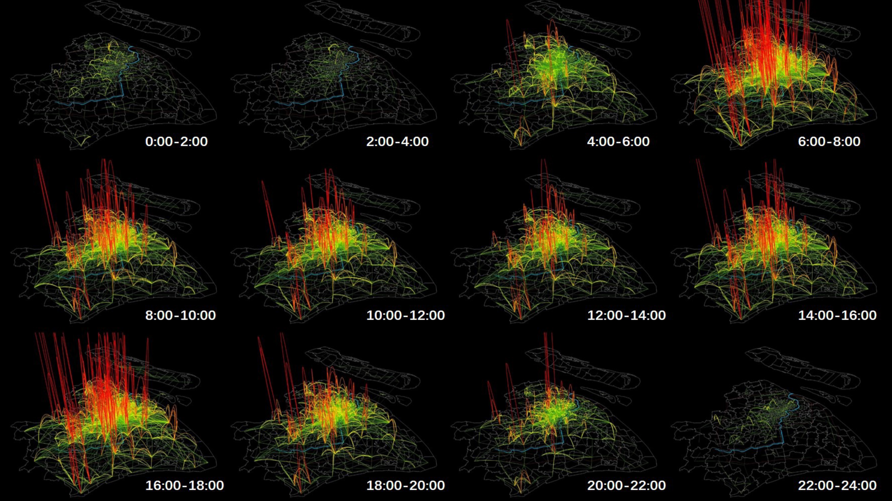

 

### Urban Computing and AI

<table>
<tr>
  <!-- 1 ▸ Human Mobility and Land Use -->
  <td width="50%" valign="top">
     
    <strong>
      <a href="https://doi-org.proxy.library.nyu.edu/10.1177/23998083221103261">
        Human Mobility and Land Use Patterns
      </a>
    </strong> 
    Explore the land use functional variance based on mobile phone derived human activity in Shanghai
  </td>

  <!-- 2 ▸ Human Mobility and Land Use -->
  <td width="50%" valign="top">
     
    <strong>
      <a href="https://doi-org.proxy.library.nyu.edu/10.1177/23998083221103261">
        Human Mobility and Land Use Patterns
      </a>
    </strong> 
    Explore the land use functional variance based on mobile phone derived human activity in Shanghai
  </td>
</tr>

<table>
<tr>
  <!-- 1 ▸ Human Mobility and Land Use -->
  <td width="50%" valign="top">
     
    <strong>
      <a href="https://doi-org.proxy.library.nyu.edu/10.1177/23998083221103261">
        Human Mobility and Land Use Patterns
      </a>
    </strong> 
    Explore the land use functional variance based on mobile phone derived human activity in Shanghai
  </td>

  <!-- 2 ▸ Human Mobility and Land Use -->
  <td width="50%" valign="top">
     
    <strong>
      <a href="https://doi-org.proxy.library.nyu.edu/10.1177/23998083221103261">
        Human Mobility and Land Use Patterns
      </a>
    </strong> 
    Explore the land use functional variance based on mobile phone derived human activity in Shanghai
  </td>
</tr>

 
