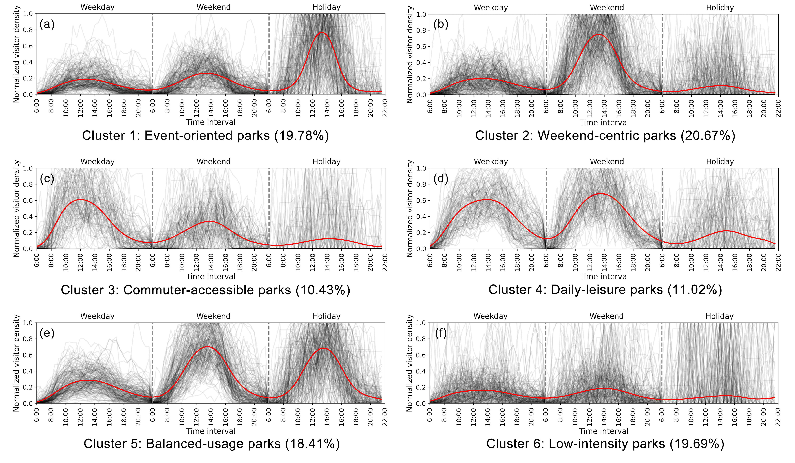
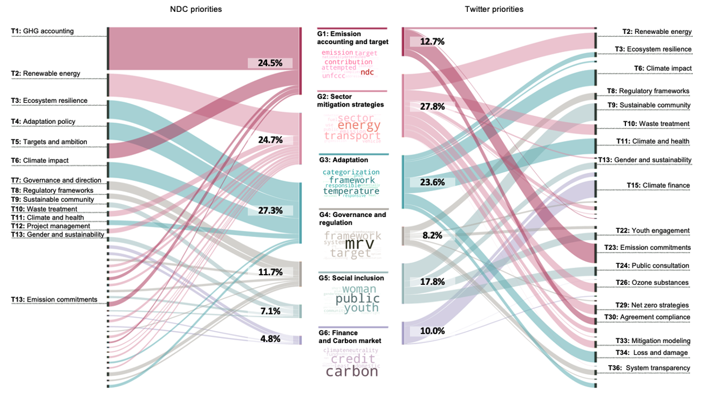

### Urban Computing and AI

  <a href="https://doi-org.proxy.library.nyu.edu/10.1177/23998083221103261">
    
    
More Details

  </a>

<strong>
      
        Human Mobility and Land Use Patterns
      
    </strong> 
Land use functions can categorize places where people perform different socioeconomic activities. However, mobility patterns might vary significantly even within the same land use function as conventionally defined. This project explores land use subcategorization using mobile phone-derived human activities. 

 

<a href="https://urban.shanghai.nyu.edu/planning-environmentally">
  

    
    
More Details

  

</a>
 
<strong>
      
        Planning for Rhythmized Urban Parks
      
    </strong> 
This project proposes a paradigm shift in classifying, programming, and designing parks. Utilizing 1.5 million mobile phone records, we classified 254 urban parks in Tokyo based on their visitation patterns across different times of the day, week, and year. 

 

<a href="https://aaa">
  

    
    
More Details

  

</a>
 
<strong>
      
        Detecting Climate Change Perception Gaps using LLMs
      
    </strong> 
Our team integrated 195 Nationally Determined Contributions (NDCs) with approximately 400,000 climate-related Twitter posts from January to December 2022. We employed ClimateBERT to quantify global and city-level gaps between governmental action and public perception.

---

### Urban Computing and AI

  <a href="https://doi-org.proxy.library.nyu.edu/10.1177/23998083221103261">
    
    
More Details

  </a>

<strong>
      
        Human Mobility and Land Use Patterns
      
    </strong> 
Land use functions can categorize places where people perform different socioeconomic activities. However, mobility patterns might vary significantly even within the same land use function as conventionally defined. This project explores land use subcategorization using mobile phone-derived human activities. 